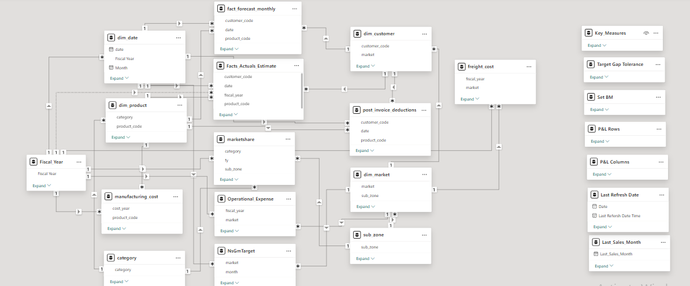
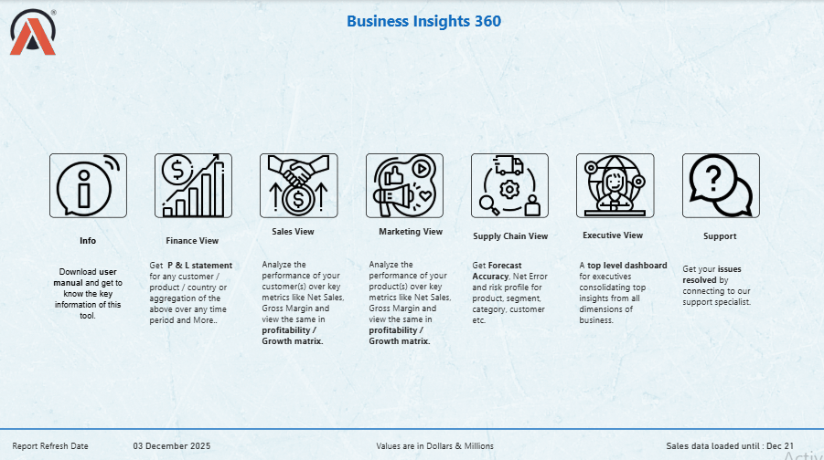

# Business Insights 360

## Project Overview

AtliQ Hardware is growing rapidly in the recent years, and they have decided to implement the data analytics using PowerBi in their company for the first time to surpass their competitors in the market and to make data driven decisions. This project is hoped to give answers to the questions of stakeholder in terms all the aspects like finance, sales, marketing and supply chain.

I worked on this project by following the Codebasics PowerBi Course, Link to the course is [here](https://codebasics.io/courses/power-bi-data-analysis-with-end-to-end-project)

[Live Report Link](https://app.powerbi.com/groups/me/reports/046a68d2-0961-405f-a32a-4b6aa9c47eb3/ReportSection0e765c0061580b067c73?experience=power-bi)

## Tech stacks

- SQL
- PowerBi Desktop
- Excel
- DAX language
- DAX studio (for optimizing the report)
- Project charter file

## PowerBI techniques Learnt

- What are all the questions should be asked before staring the project
- Creating calculated columns
- Creating measures using DAX language
- Data modeling
- Using Bookmarks to switch between two visuals
- Page navigation with buttons
- Using divide function to prevent zero division errors
- Creating date table using m language
- Dynamic titles based on the applied filters
- Using KPI indicators
- Conditional formatting the values in visuals using icons or background color
- Data validation techniques
- PowerBi services
- Publishing reports to PowerBi services
- Setting up personal gateway to set up the auto refresh of data
- PowerBi App creation
- Collaboration, workspace, access permissions in PowerBi services

## Business related terms

- Gross price
- Pre-invoice deductions
- Post-Invoice deductions
- Net Invoice sale
- Gross Margin
- Net sales
- Net profit
- COGC - cost of goods sold
- YTD - Year to Date
- YTG - Year to Go
- Direct
- Retailer
- Distributors
- Consumer

## Company's Background

AltiQ hardware is a company which has grown vastly in the recent years, and opened business all over the globe. It is a company which sells, computer and computer accessories through three mediums/channel

- Retailers
- Direct
- Distributors

Recently the company has faced an unforeseen loss by opening store in America based on the surveys, intuition and some excel analysis and also the company's competitors has handful of analytics team to perform analysis and make data driven decision. So, the AltiQ hardware has no other option other than building their analytics team for data driven insights and decisions in the future to survive better in the industry. 

Project kick off session, where you should get clear of for what and why this project and all other questions you have with regards to the project

### Questions to ask before starting with dashboard

- What is the objective of building this PowerBi dashboard?
- In what terms the success of this project will be measured?
- What will be time dead-line of the project?
- do the stakeholders expect pre-view before the actual release?
- What are all the hopes stakeholders have out of this project?
- what are all fears the stakeholder have in terms of building this dashboard?
- Who all will be using this dashboard and for what purpose?
- What expectations do the stakeholders have, by the completion of this project?
- What can go wrong while building this project?
- What are all the resources/ data needed to build this dashboard?
- Is there any inputs from stakeholders in terms of design and views of the dashboard?

After the project kick off meetings, the data engineering team has given the data as per the request from the data analytics team, let’s explore them.

### Dataset **Understanding.**

Understanding what data is available will be more helpful while doing analysis. Before jumping on to the analysis get good understanding of what are data available.

Dimension table : It will have the static data like details of customer and products

Fact table : It will have the data about the transactions

- gdb041:
    - dim_customer
        - **27** distinct markets (ex India, USA, spain)
        - **75** distinct customers thorough out the market
        - **2** types of platforms
            - Brick & Mortar - Physical/offline store
            - E-commerce - Online Store (Amazon, flipkart)
        - Three channels
            - Retailer
            - Direct
            - Distributors
    - dim_market
        - **27** distinct markets (ex India, USA, spain)
        - 7 sub-zones
        - 4 regions
            - APAC
            - EU
            - nan
            - LATAM
    - dim_product
        - Divisions
            - P & A
                - Peripherals
                - Accessories
            - PC
                - Notebook
                - Desktop
            - N & S
                - Networking
                - Storage
        - There are 14 different categories, Like Internal HDD, keyboard
        - There are different variants available for the same product
    - fact_forecast_monthly
        - This table is used to forecast the customer's need in advance, which can help in
            - Higher customer satisfaction
            - Reduced cost in warehouses for storage purpose
        - The table is denormalized by data engineering team, as it is a data warehouse which is aimed to be used for analytical work.
        - All the date of the month will be replaced by the start date of the month
        - It will have all the column names and in the end it will have the forecast quantity.
    - fact_sales_monthly
        - This table is more or less same as fact_forecast_monthly table, but the last column has the value of sold quantity instead of forecast value.
- gdb056
    - freight_cost
        - This table has details of travel cost and other cost for each market with fiscal year
    - gross_price
        - Has the details of gross prices with product code
    - manufacturing_cost
        - Has the details of manufacturing cost with product code with year
    - Pre_invoice_deductions
        - Has the details of pre invoice deductions percentage for each customer with year
    - Post_invoice_deductions
        - Post invoice deductions and other deductions details

## Importing data into PowerBi

- As the database is MySQL in this project, we need to import the datasets from Mysql database to PowerBi by providing the Database access credential

## Data Model

- Data modeling plays a vital role and is considered as the basement of report. All the visuals will be build upon the data model.
- Poor data modeling affects the over all performance of the report.
- Following Good practices of data modeling is must.

In this project, we have followed Snowfall data modeling method.

  

### Dashboard designing

Based on the mock ups received as requirement, the team will start designing the visuals and create measure as and when required

## Home view

In Home view, all the views button will be available. User will land on specific view page by clicking the button 

- Info
- Finance View
- Sales View
- Marketing View
- Supply chain View
- Executive View
- Products
- Support

## Overall Report

## Finance View

## Sales View

## Marketing View

## Supply chain View

## Executive View

##  Business Impact

This dashboard enables business leaders and functional teams to make faster,
data-driven decisions by providing a unified 360-degree view of performance.

### Key Business Outcomes
- Reduced manual reporting effort by consolidating Finance, Sales, Marketing,
  and Supply Chain metrics into a single interactive dashboard
- Improved visibility into **profitability drivers**, helping identify
  margin leakage across regions and products
- Enabled leadership to track **Net Sales, Gross Margin, and Net Profit**
  against benchmarks and targets in real time
- Enhanced forecast accuracy by comparing **actuals vs forecast** trends
  across time periods
- Supported strategic decision-making by highlighting
  **top/bottom customers, products, and markets**

### Decision Enablement
- **Finance Team:** Monitor P&L performance, cost structure, and profitability
  drivers at granular levels
- **Sales Team:** Identify high-performing customers, regions, and product
  segments to optimize revenue growth
- **Marketing Team:** Analyze campaign and segment performance to understand
  demand patterns, customer mix, and market response across regions
- **Supply Chain Team:** Track demand vs supply gaps and forecast alignment to
  improve inventory planning
- **Executive Leadership:** Access a high-level KPI snapshot with the ability to
  drill down into detailed insights

## Download Report & Open the Power BI Report

This project is maintained in **PBIP format** for better version control, which enables better version control and collaboration.

To view or edit the report locally:

Download the full Power BI project from the link below

Open the .pbip file using Power BI Desktop

Power BI Project Files:

[View full Power BI project](https://github.com/shettydaishwarya/Business_Insights_360/tree/main/Report)

## Project Outcome

By using this report, decisions can be taken based on the data. Further it will help in answering n number of why questions based on the situations.

